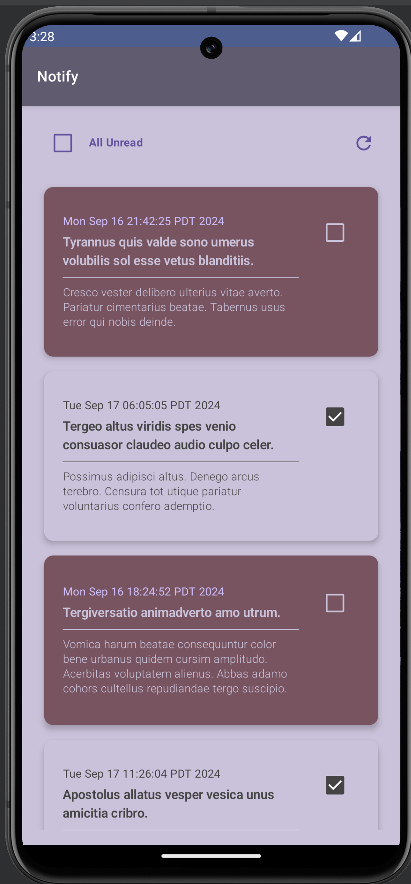

# notify
Compose App Showcasing Notification List Using Modern Android Architecture

## Setup
- Android Studio
- Clone GitHub Repo
- Build & Run

## Architecture Highlights Of The App
- Jectpack Compose
- Kotlin Coroutines
- Hybrid MVVM + MVI Architecture using ViewModels  
- Hilt Dependency Injection
- Retrofit
- Arrow
- Code Modularization
- Material Design
- 100% Kotlin

## Functionalities
- Fetching & Displaying Notifications
- Automatically Marking the notification as read after 3 secs of visibility.
- Infinite Scrolling
- Manual Marking as Read of individual Notification
- Manual Marking as Un-Read/Read for all notifications
- Refresh UI Button for on demand reloading
- Smooth transitions
- Responsive UI

# Architecure Decision

App uses MVVM architecture which helps in encapsulating business logic from the view. Also combines State logic from MVI architecture. View UI can't be directly updated. All updates need to happen through the state which are updated by view models. 
This architecture also helps in maintaing the screen state when re-composition of Composables happen for scenarios like Device Rotation.

# Challenges
- Time Constraint. Lot can be done to improve the UX design & add more functionalities.
- One issue I which took sometime to debug was latest Material 3 library updates has broken some features like CircularProgressIndicator, had to do some research to update Material 3 librbary to correct working verson.
- Hilt Dependency Injection Set Up took some time as well.

# Potential Future Improvements
- Offline Support
- Animations
- UI/Unit Test Cases

# Screenshot

